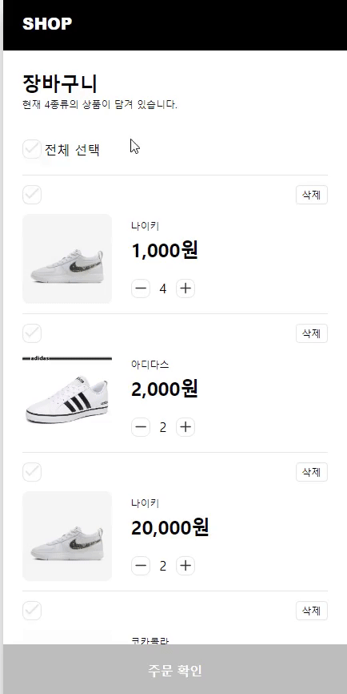

# react-shopping-cart

## 배포

[🖱️ 배포 페이지 바로 가기](https://badahertz52.github.io/react-shopping-cart/dist/)

## 구현



## build

```dash
npm run build
```

- 빌드 시, EnvironmentPlugin 로 인해 오류가 나서 빌드 시에는 EnvironmentPlugin 관련 주석 처리와 import.meta.env로 설정 하고 빌드 해야 합니다.

## test

```dash
npm run test
```

- 로컬에서 테스트시 EnvironmentPlugin 관련 설정을 활성화 하고 import.meta.env 가 아니 process.env를 사용해야 합니다.

## 기능 구현 목록

<details>
  <summary>step1</summary>
  <div markdown="1">
  
### 페이지 마크업 구현
#### Page
- OrderPage
- OrderConfirmPage
#### Common
- Checkbox
- DeleteButton
- PrimaryButton
- Divider

#### OrderPage 하위 컴포넌트

- CartItem
- CartList
- OrderPrice

### 장바구니 목록 구현

#### 장바구니 API

- Suspense
- ErrorBoundary

#### 장바구니 상태

1. 장바구니 목록

- atoms
  - cartItems(CartItem(name, image, price, isChecked, quantity)[x])
  - quantity(number)

#### 장바구니가 없을 때 fallback ui

#### 새로고침 시 화면 유지 기능 구현

- 상품 체크, 상품 수량 관리

### 장바구니 상품 수량 변경

### 장바구니 상품 삭제

### 총 결제 기능 계산 구현

    1. 금액
    - selectors
      - selectedItems(cardItems에서 isChecked가 true인 item들)
      - totalPrice (orderPrice + shippingPrice)
        - orderPrice(각 cartItems의 price \* quantity)
        - shippingPrice(orderPrice)
          - 결제 금액이 10만원 이상일 경우에 무료

### 주문 확인 기능 구현

- 주문 확인 버튼을 눌렀을 때 주문 확인 페이지로 이동한다.
- 주문 확인 페이지에선 다음과 같은 데이터를 보여줄 수 있어야 한다.

  - 상품 종류
  - 상품 개수
  - 총 결제 금액

- 뒤로 가기 버튼을 누르면 다시 장바구니 목록 페이지로 이동해야한다.

  - 장바구니 목록 페이지는 이전 데이터를 유지할 수 있어야 한다.

        </div>

      </details>
    <details>
      <summary>step2</summary>
      <div markdown="1">

  ### 페이지

  - 장바구니 페이지
  - 주문 확인 페이지 (update)
  - 결제 확인 페이지 (new)

  ### 주문 확인 페이지 마크업

  - [] 주문한 상품 : 상품명, 가격, 수량
  - [] 쿠폰 적용 버튼 : 쿠폰 모달 창 열림
  - [] 제주도 및 도서 산간 지역 체크 박스
  - [] 금액
    - 주문 금액
    - 쿠폰 할인 금액
    - 배송비
    - 총 결제 금액
  - [] 결제하기 버튼
    - 클릭 시 결제 확인 패이지로 이동

  ### 쿠폰 모달창 마크업

  - [] 쿠폰 사용 안내 문구
  - [] 쿠폰 목록
  - [] 쿠폰 비활성화
    - 사용 불가한 쿠폰
    - 적용대상이 아닌 쿠폰
    - 이미 쿠폰 2개를 선택한 경우 선택되지 않은 쿠폰
  - [] 쿠폰 적용 버튼
    - 쿠폰 적용 시 할인금액
    - 클릭 시 할인금액 적용

  ### 쿠폰 기능

  #### 쿠폰 유효성(만료 일자) 검사

  - [x] 만료일이 있는 쿠폰인 경우, 사용 날짜가 만료일 이전인지 판단한다.

  #### 쿠폰 적용 여부

  - [x] 현재 주문 상황과 비교해 쿠폰 적용 여부를 판단한다.

  #### 쿠폰 활성화, 비활성화

  - [] 사용 불가한 쿠폰은 비활설화한다.
  - [] 사용자가 2개의 쿠폰을 고르면, 사용 가능한 나머지 쿠폰은 비활성화 된다.
  - [] 사용자가 2개의 쿠폰을 골랐다가 하나를 선택해제하면 4에서 비활설화 되었던 사용가능한 쿠폰들을 활성화된다.

  #### 쿠폰 할인 적용

  - [x] 쿠폰별 할인 금액을 계산한다.
  - [] 선택한 쿠폰으로 받을 수 있는 최대 할인 금액을 적용한다.

  ### 배송비

  #### 무료 배송

  - [] 총 주문 금액이 100,000원 이상일 경우 무료 배송 혜택이 적용된다

  #### 제주도 및 도서 산간 지역: 배송비 추가

  - [] '배송지가 제주도 및 도서 산간 지역입니까?'라는 체크박스에 체크를 했다면, 배송비를 3천원 추가한다.
    </div>
  </details>
